## Cards

## Live Example

- [Cards with useEffect and useState hooks](https://beautiful-tiramisu-b20117.netlify.app/)

## Reviews

## Live Example

- [Reviews with useState hook and index handling](https://sage-crisp-b4c150.netlify.app/)

## Questions

## Live Example

- [Questions with useState hook](https://calm-sunflower-94db63.netlify.app/)

## Menu

## Live Example

- [Menu with useState hook and filtering the categories of a dataset](https://magnificent-sundae-57951c.netlify.app/)

## Tabs

- [Tabs updating indexes with useState hook](https://stellular-cobbler-1e47a7.netlify.app/)

## Slider

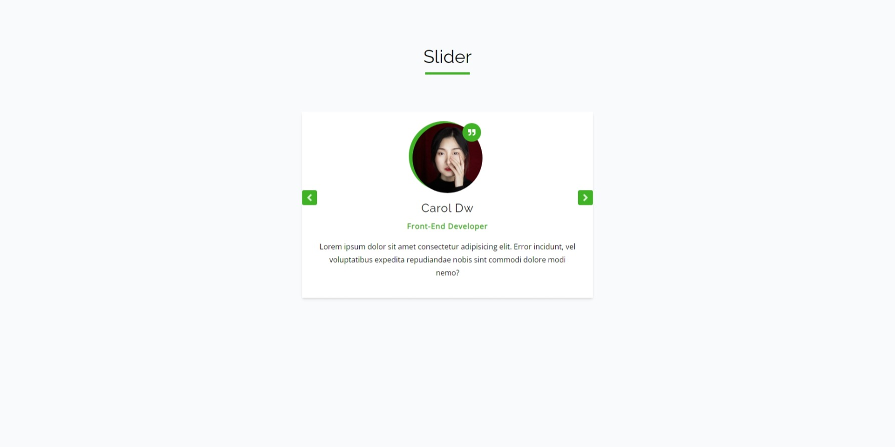

## Live Example

- [Slider with useState and useEffect hooks](https://glowing-bubblegum-a992ff.netlify.app/)

## Lorem Ipsum

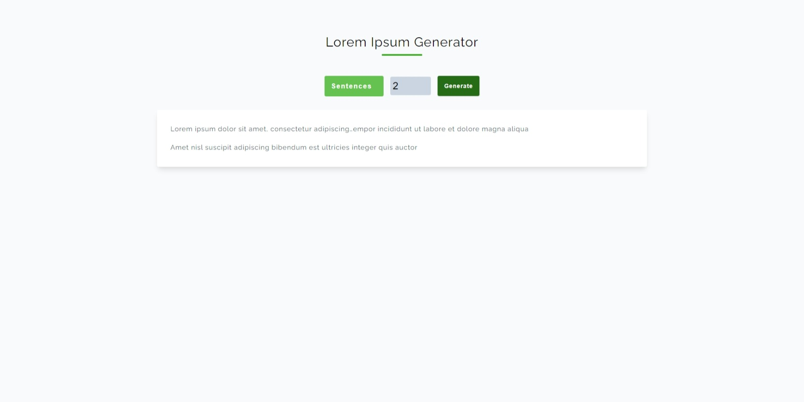

## Live Example

- [Lorem ipsum generator with input states using useState hook](https://lustrous-gingersnap-a23de8.netlify.app/)

## Color Generator

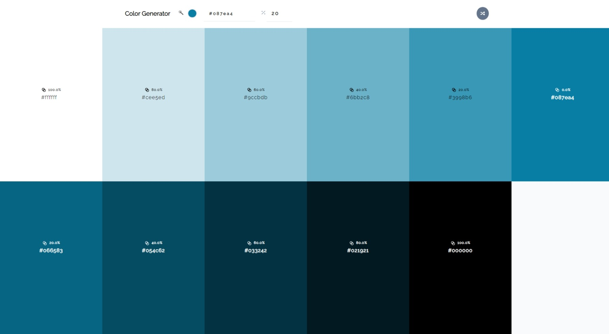

## Live Example

- [Color generator with input states using useState and useEffect hooks](https://golden-pasca-f1b1a8.netlify.app/)

## Task Manager

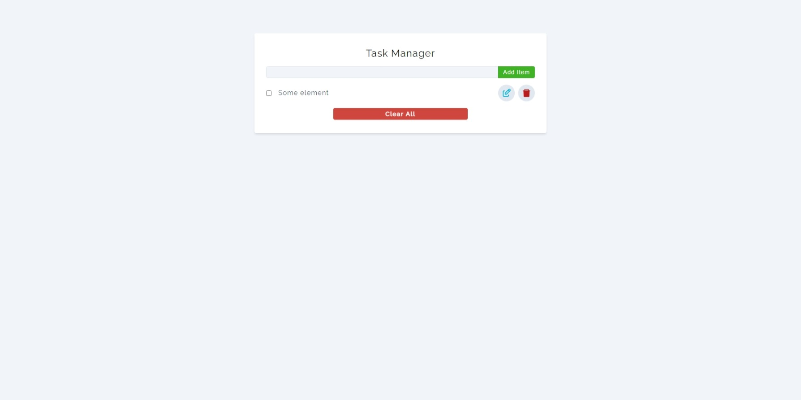

## Live Example

- [Task manager using useState hook and localstorage](https://strong-druid-eb378d.netlify.app/)

## Navbar

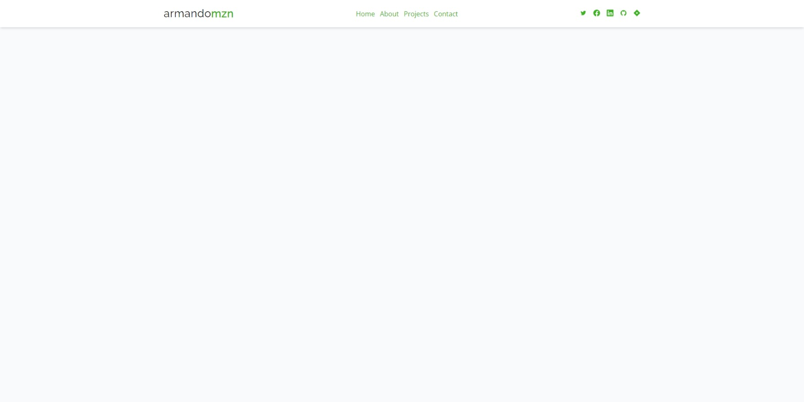
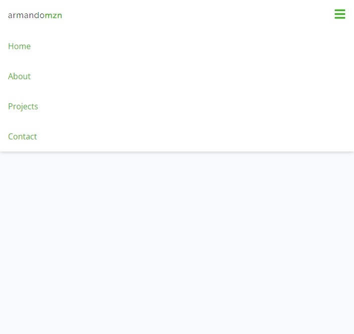

## Live Example

- [Responsive Navbar using useState, useEffect and useRef hooks](https://comforting-faloodeh-6bd6c6.netlify.app/)

## Sidebar-Modal

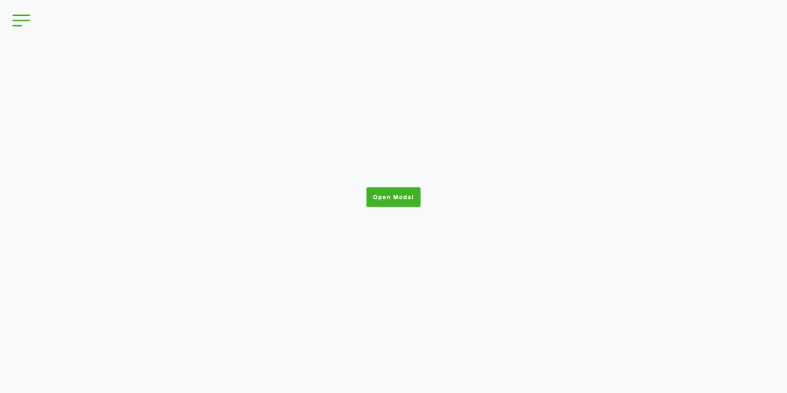
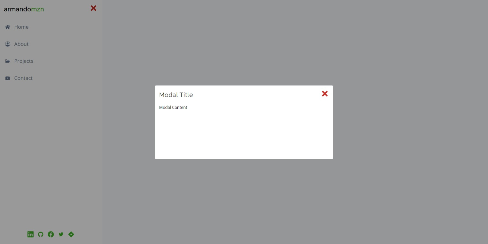

# Live Example

- [Sidebar and Modal components using Context Api](https://graceful-pothos-48b1d5.netlify.app/)

## Strapi Menu

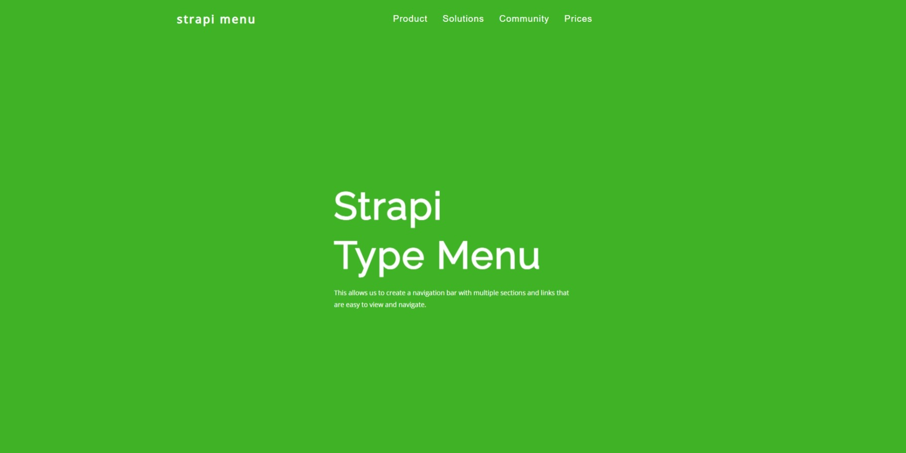
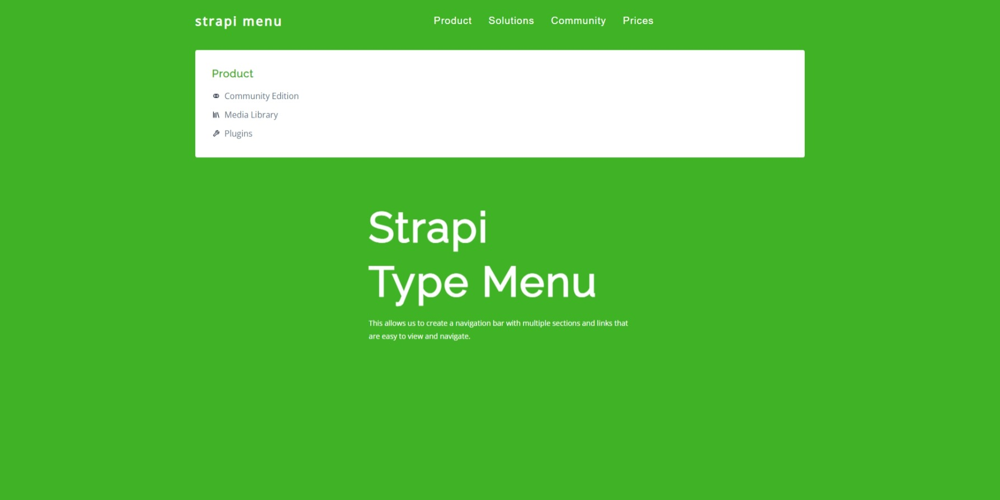
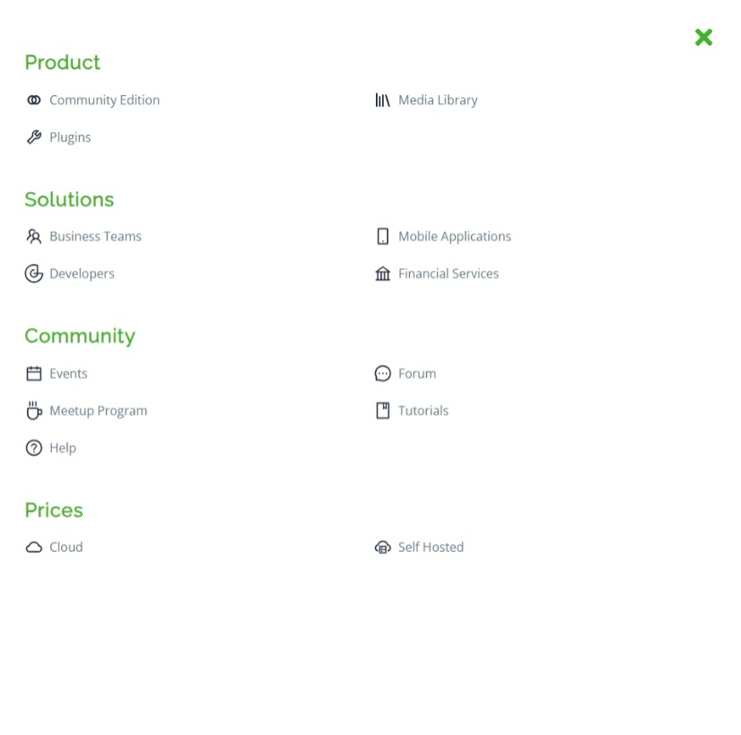

## Live Example

- [Strapi type menu using Context Api, useState and useRef hooks](https://ornate-dragon-6c5bb2.netlify.app/)
